<h1>Protocol draft</h1>

## Overview

PCP allows text, hypertext, images, sound and files to be transferred between devices in a chat, meaning the log of everything sent is mantained in a database on every partecipating device.
The main audience and use for this protocol are local users and computers inside an organization, since passwords and the eventual server must be well known.

The mantra of the protocol is to always have control, wich means it prefers peer-to-peer comunications over server-based ones, altough those are provided by the protocol to initialize a chat between two distant peers or eventually save a chat database.

Group chats are also based on a super-client, which could be any online and active client in a group chat. When every client is offline, the chat is over, and eventually the database is saved on a server known by all the other peers to access again.

## Structure

illustration of an hypotetical PCP domain

### client
Cleints are the foundamental agents in PCP, exchanging information between them, in the following ways:
- peer-to-peer chat
- client-server group, hosted by a [super-client](#super-client)

### super-client
A Super client is the machine responsable for coordinating all the other peers. Its role is transferable only when it is shutting down.

A super client is also responsable to keep the chat logs, and serve cronology requests to the other clients in the chat.

### server
Servers do only serve cronology and name solving requests, they do not manage the chats

### domain
A domain is the extension limit of a chat, defined by how far a server is reachable.
For example, the domain of a non internet-exposed PCP server on a local network is the network itself. Out of this network the domain and every data and user within it unreachable.

## Types of comunications

### Two agents chat
A two agents chat is a chat between TWO clients, both of them have a copy of the chat database.

If one deletes the database and re-enters in the chat, it requests the database to the other peer.
If the other client has deleted the chat as well, and didn't backup it, the chat is lost.

### Multiple agents chat
A multiple agents chat is a chat between TWO or MORE clients, hosted by a super-client.
The super-client can be any of the clients, and its role can be passed to other clients when it shuts down.

Every client has a copy of the database, which is shared between the peers.
Of one delets the databae and re-enters the multiple agents chat, it requests the database to the current super-client.
If there aren't any other clients online, the chat is dead and the database will be deleted; meaning that if every client deletes the database, the multiple agents chat database is lost.

### Group chat
A group chat is a chat between TWO or MORE clients, hosted by a server.

The server is always online, and keeps a copy of the databses. It is the sole agent responsable for keeping the chat content.
Clients do keep small databases of group chats.
