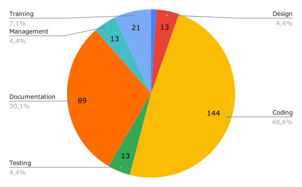

<h1>Project Closure Report</h1>

# Results

## Project Metrics
|                                    |                                                |                                          |
| ---------------------------------- | ---------------------------------------------- | ---------------------------------------- |
| **Project Name**                   | Potato Chat Protocol                           |
| **Manager**                        | [@JacopoWolf](https://github.com/JacopoWolf)   |
| **Scope**                          | see the [vision statement](visionstatement.md) |
| **Project Type**                   | New Development and protocol Design            | *New development, Mantainence, Learning* |
| **Problem Domain**                 | Comunications                                  | *Comunications, Finance, Healtcare*      |
| **Initial Technology Familiarity** | 4                                              | *0-10 where 10 = very familiar*          |
| **Start-Finish Dates**             | 20/10/2019 - 12/12/2019                        | **relative to development phase*         |
| **Duration (weeks)**               | 7,6                                            |

## Effort Distribution
Effort is calculated assigning numbers on the fibonacci sequence (1,2,3,5,8,13,...)
|                      |     |
| -------------------- | --- |
| **Requirements**     | 3   |
| **Design**           | 13  |
| **Coding**           | 144 |
| **Testing**          | 8   |
| **Documentation**    | 89  |
| **Proj. Management** | 13  |
| **Training**         | 21  |
| **TOTAL**            | 296 |

## Staff 
See the **budget** section in the [software project management plan](spmp.md)

## Size

## Cost
The final effective monetary cost of the project is **0€**

## Pulse

See the Pulse graph on **GitHub**

https://github.com/JacopoWolf/PotatoChatProtocol/graphs/contributors