<h1>Software project management plan</h1>

- [Overview](#overview)
  - [purpose and scope](#purpose-and-scope)
  - [goals and objectives](#goals-and-objectives)
  - [project deliverables](#project-deliverables)
  - [constraints](#constraints)
  - [Schedule](#schedule)
  - [budget](#budget)
  - [success criteria](#success-criteria)
  - [definitions](#definitions)
- [Startup plan](#startup-plan)
  - [team organization](#team-organization)
  - [project comunications](#project-comunications)
  - [technical process](#technical-process)
  - [tools](#tools)
- [Work plan](#work-plan)
  - [release plan](#release-plan)
  - [Iteration plans](#iteration-plans)

---

For **PotatoChatProtocol**, version 1.0 approved

Prepared by [@JacopoWolf](https://github.com/JacopoWolf)

Server Group:
* [@JacopoWolf](https://github.com/JacopoWolf)
* [@gfurri20](https://github.com/gfurri20)
* [@Alessio789](https://github.com/Alessio789)

---

# Overview

## purpose and scope
We are interested in implementing the server side of the **PCP Minimal** protocol specification.

The server application has the purpose of allowing the clients to chat between each other using the protocol.

The ideal target machine for this implementation should be servers, but due to the simple nature of the protocol target machines are going to be average PCs, with at least a multi core processor to handle parallelism.

Being a server, instead of an UI it uses a logging system, expandable to allow persistent logs.

## goals and objectives
- develop easy-to-use APIs for the PCP protocol
- create a server with the following characteristics
  - functioning
  - easy-to-use
  - performant
  - light
  - working public chat
- instruct the group about:
  - Git 
  - GitHub
  - scrum
  - normal development workflow

## project deliverables

|                    Deliverable | Date       |
| -----------------------------: | :--------- |
|                 Iteration plan | 20/10/2019 |
|              packets - Min.a.1 | 14/11/2019 |
| interpretation layer - Min.a.2 | 18/11/2019 |
|           core logic - Min.b.0 | 03/12/2019 |
|        final version - Min.1.0 | 12/12/2019 |
|         complete documentation | 06/01/2019 |

## constraints
- project manager will be Maven

## Schedule

## budget
on paper, based on the average cost of the respective work position:

|                     name                     |                  role                  |        frequency         |  hrs  |  €/h  | cost [€] |
| :------------------------------------------: | :------------------------------------: | :----------------------: | :---: | :---: | :------- |
| [@JacopoWolf](https://github.com/JacopoWolf) | project manager/   junior developer | 6 to 10 h/week * 8 weeks |  64   |  60   | 3.840    |
|   [@gfurri20](https://github.com/gfurri20)   |            junior developer            | 5 to 9 h/week * 8 weeks  |  56   |  40   | 2.240    |
| [@Alessio789](https://github.com/Alessio789) |            junior developer            | 5 to 9 h/week * 8 weeks  |  56   |  40   | 2.240    |
|                                              |                                        |                          |       |       | 8.320    |

## success criteria
A working server.

## definitions
| term           | definition                                |
| :------------- | :---------------------------------------- |
| Server         | the APIs used to instantiate a PCP server |
| "the protocol" | the Potato Chat Protocol specification    |

# Startup plan
## team organization
|      Role       | Actors                                          | Responsability                                                                                                                                                                        |
| :-------------: | :---------------------------------------------- | :------------------------------------------------------------------------------------------------------------------------------------------------------------------------------------ |
| Project manager | Comparin Jacopo                                 | Call team meetings, coordinate communications within group, coordinate communications outside group, break out tasks, assign them to teammates                                        |
|    Developer    | Comparin Jacopo, Geremia Furri, Trentin Alessio | Develop software based on requirement and architect specifications                                                                                                                    |
|    Debugger     | "                                               | Fix reported errors in the code                                                                                                                                                       |
|     Tester      | "                                               | Write test cases, perform unit testing of test cases against incremental release of code, perform integrated testing of test cases against incremental release of code, report issues |

## project comunications
| Event            | Information                                                                                                     | Audience                   | Format                                                                          | Frequency |
| ---------------- | --------------------------------------------------------------------------------------------------------------- | -------------------------- | ------------------------------------------------------------------------------- | --------- |
| Team meating     | Task status: completed since last meeting & planned for next; obstacles encountered; change requests in process | All team members           | Informational meeting upon starting to work on the project in the same location | As needed |
| Notifications    | A Telegram notificaion on the group specifically created                                                        | All team members           | A telegram message                                                              | as needed |
| End users doubts | Informal meeting whith beta users to discuss bugs and code enhacements                                          | End users and team members | Infomational meeting                                                            | As needed |

## technical process    
An iterative and incremental development process is planned.  Feedback will be used from each iteration to improve the next.  The first iteration will focus on basic functionality of the application.  Subsequent iterations will build upon that and incorporate more features as time allows.

## tools
- Programming languages:
  - Markup
  - Java
- JDK 1.8 (platform)
- GitHub (VCS) 
- NetBeans (IDE)

# Work plan
## release plan
The release plan is in a [specific document](../404.md)
## Iteration plans
The iteration plan is in a [specific document](../404.md)