<h1> Software Requirements Specification </h1>

- [Revision History](#revision-history)
- [1 Introduction](#1-introduction)
  - [1.1 Purpose](#11-purpose)
  - [1.2 Document Conventions](#12-document-conventions)
  - [1.3 Intended Audience and Reading Suggestions](#13-intended-audience-and-reading-suggestions)
  - [1.4 Project Scope](#14-project-scope)
  - [1.5 References](#15-references)
- [2 Overall Description](#2-overall-description)
  - [2.1 Product Perspective](#21-product-perspective)
  - [2.2 Product Functions](#22-product-functions)
  - [2.3 Operating Environment](#23-operating-environment)
  - [2.4 Design and Implementation Constraints](#24-design-and-implementation-constraints)
  - [2.5 User Documentation](#25-user-documentation)
  - [2.6 Assumptions and Dependencies](#26-assumptions-and-dependencies)
- [3 External Interface Requirements](#3-external-interface-requirements)
  - [3.2 Hardware Interfaces](#32-hardware-interfaces)
- [4 System Feature](#4-system-feature)
  - [4.1 Server](#41-server)
- [5 Other Nonfunctional Requirements](#5-other-nonfunctional-requirements)
  - [5.1 Performance Requirements](#51-performance-requirements)
  - [5.2 Safety Requirements](#52-safety-requirements)
  - [5.3 Security Requirements](#53-security-requirements)
  - [5.4 Software Quality Attribute](#54-software-quality-attribute)
  - [5.5 Business Rules](#55-business-rules)
- [6 Optional Requirements](#6-optional-requirements)

For **PotatoChatProtocol**

Version 1.0 approved

Prepared by [@gfurri20](https://github.com/gfurri20)

Server Group:
* [@JacopoWolf](https://github.com/JacopoWolf)
* [@gfurri20](https://github.com/gfurri20)
* [@Alessio789](https://github.com/Alessio789)

November 25, 2019

## Revision History

|                   Name                   |    Date    | Reason for Changes | Version |
| :--------------------------------------: | :--------: | :----------------: | :-----: |
| [@gfurri20](https://github.com/gfurri20) | 25/11/2019 |  Initial Document  |   1.0   |
|                                          |            |                    |         |

## 1 Introduction
### 1.1 Purpose
The purpose of this document is to present a detailed description of the PotatoChatProtocol standard. It will explain the purpose and features of the software, the interfaces of the software, what the software will do and the constraints under which it must operate. This document is intended for developers who want to implement this protocol.

### 1.2 Document Conventions
This document is based on the IEEE template for System Requirement Specification (SRS) document.

### 1.3 Intended Audience and Reading Suggestions
* Typical Users, such as developers, who want to use PCP to develop their chat applications.
* Students who are interested to discover how an extremely simple chat works.
* Small realities who need a way to talk between rooms withouth yelling and withouth losing control of their messages.

### 1.4 Project Scope
PotatoChatProtocol is a an extremely easy, portable and expandable protocol which can be used as base to develop a chat application.

### 1.5 References
PCP's main page:
[https://jacopowolf.github.io/PotatoChatProtocol](https://jacopowolf.github.io/PotatoChatProtocol) \
PCP's Github page:
[https://github.com/JacopoWolf/PotatoChatProtocol](https://github.com/JacopoWolf/PotatoChatProtocol) \
PCP's Jitpack page:
[https://jitpack.io/#JacopoWolf/PotatoChatProtocol](https://jitpack.io/#JacopoWolf/PotatoChatProtocol)

## 2 Overall Description

### 2.1 Product Perspective
PCP is a protocol developed in order to have the possibility to implement an easy and portable chat application.

### 2.2 Product Functions
Server side:
* build a server ready to manage connected clients and exchange messages between them.

### 2.3 Operating Environment
All operating systems that have a java virtual machine installed.

### 2.4 Design and Implementation Constraints
This project is developed with Java using NetBeans as IDE. The packages are organized according to the protocol versions. It uses a modular design where every feature is wrapped into a separate module and the modules depend on each other through well-written APIs.

This is the structure of the API:

### 2.5 User Documentation
There is a quick guide which explains how to initialize a PCPServer:
[https://github.com/JacopoWolf/PotatoChatProtocol/blob/master/docs/usage.md](https://github.com/JacopoWolf/PotatoChatProtocol/blob/master/docs/usage.md)

Moreover there is the Javadoc, hosted on JitPack:
[https://javadoc.jitpack.io/com/github/jacopowolf/potatochatprotocol/Min.a.3/javadoc/index.html](https://javadoc.jitpack.io/com/github/jacopowolf/potatochatprotocol/Min.a.3/javadoc/index.html)

### 2.6 Assumptions and Dependencies
PCP is developed in Java so to start-up a server the machine requires a Java version 8 (recommended) or higher and JDK version 8 (recommended) or higher.

## 3 External Interface Requirements

The server implemented by PCP only print the logs. No graphical interfaces have been implemented. Clients that rely on PCP will implement it.

### 3.2 Hardware Interfaces
The protocol is very light, so you can activate it on most modern machines.

## 4 System Feature

### 4.1 Server
PCP offers the possibility to start a server which is able to manage the communication between several connected users. \
A simple guide is avaible: [https://github.com/JacopoWolf/PotatoChatProtocol/blob/master/docs/usage.md](https://github.com/JacopoWolf/PotatoChatProtocol/blob/master/docs/usage.md)

## 5 Other Nonfunctional Requirements

### 5.1 Performance Requirements

### 5.2 Safety Requirements

### 5.3 Security Requirements

### 5.4 Software Quality Attribute

### 5.5 Business Rules

## 6 Optional Requirements