<h1> Architecture </h1>

# Hierarchy

---

<h4 style="background:orangered">NETWORK</h4>

The network component is responsable to **mange I/O** from the outside using the TCP protocol.

This layer listens for new connections and recieves data from already established ones.

It is completely *asyncronous*, and runs on a series of threads that manage the incoming bytestreams. Every bytestram is associated with a `PCPChannel`.

When new data is recieved, it is queued to be executed by the middleware, in our implementation called `PCPManager`, which runs on a single thread.

<h4 style="background:orange">CONNECTION</h4>

The scope of this layer is to **keep reference of useful variables during the TCP connection** and it's core classes are `PCPChannel`s. Those are managed by the server's middleware.

A `PCPChannel` keeps reference of the `IPCPUserInfo` object, used to keep the necessary information about a connection. It also keeps a reference to the `AsyncronousSocketChannel` used and a `ByteBuffer`, encapsulating a `byte[]` of the maximum lenght recievable by the connection.

<h4 style="background:plum">WORKLOAD</h4>

This layer is responsable of **sorting the workload between threads**, keep them alive and decide when to kill them, optimize execution, map connections, and manage data flow.

Implemented by `PCPManager`, this layer is the "bottleneck" of the whole server, because for *ensuring data consinstency* it's executed on only one thread; the operations it performs are, anyway, extremely simple. Consisting mostly of checking an `HashMap` to direct incoming data.

The `PCPManager` implementation is also responsable to keep track of all existing connections. Because of that, it's the layer data must pass through for leaving the server.

<h4 style="background:aquamarine">INTERPRETATION</h4>

Tier responsable to **interpret incoming `byte[]` into simple to use at higher level, `IPCPData` objects.** 

Those are version specific. 

<h4 style="background:lightblue">LOGIC</h4>

The logic layer is the core of the application, using the whole stack from the server to **perform business logic operations**.

This layer operates based on the results from the interpretation layer, and based on the reference to the channel that send the recieved data.

What it does is simply an opcode based set of instructions, handling requests and answering to them.

Data generated from this tier are then sent through the `IPCPManager`

<h4 style="background:lightgreen">DATA ACCESS</h4>

**Performs data access operations**.

In this implementation, it is embedded in the logic core since the Minimal version of the protocol doesn't require long term storage. It is composed of the data structures necessary to keep the server working.

# Class scheme

Below is rappresented the main class scheme.
Data and secondary classes have been omitted for semplicity.

# Execution

Execution is completely asyncronous, and is managed between **3 main thread goups**

- network 
  
  Uses at least 3 threads to manage incoming data streams and direct them to the right channel and pass them to the upper tier; and 1 thread to manage outgoing data. 4 threads in total

- workload
  
  Single thread with the purpose of sorting out incoming data to the most optimal thread.
  
  Also manages a cache cleaning daemon thread, running on schedule; with the purpose of clean and remap connections to optimize resource usage.

- logic

  number of thread in execution  is variable and managed by the middleware. Usually the number is 1 even on mid-high data flow levels.

In total, the number of concurrent threads in this implementation is around 7. Meaning a multi-core processor is better for running the library.